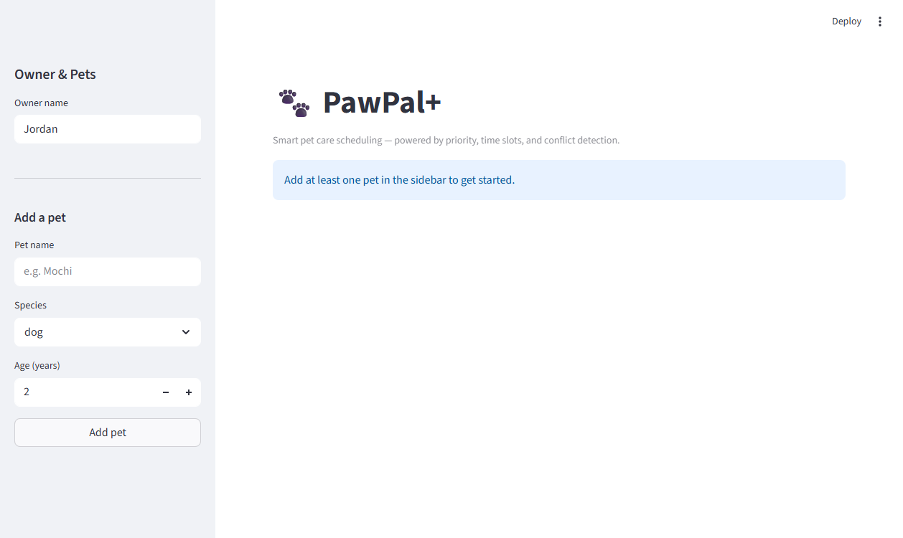
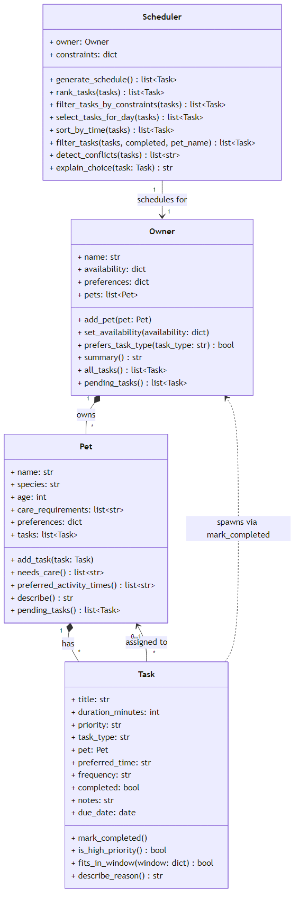

# PawPal+

A Python scheduling app that helps pet owners plan daily care tasks across multiple pets — with priority ranking, time-slot sorting, conflict detection, and automatic recurring task management.

---

## 📸 Demo



---

## Project Structure

```
pawpal_system/__init__.py   Core classes: Task, Pet, Owner, Scheduler
app.py                      Streamlit web interface (4 tabs)
main.py                     Demo script — run this to see all features
tests/test_pawpal.py        Unit tests (21 tests, all passing)
docs/reflection.md          Design and reflection notes
docs/uml_final.png          Final UML class diagram
docs/demo_screenshot.png    App screenshot
```

---

## Quick Start

**Run the web app:**
```bash
streamlit run app.py
```

**Run the CLI demo:**
```bash
python main.py
```

---

## Features

### 1. Priority-Based Task Ranking — `Scheduler.rank_tasks()`
Tasks are ranked using a three-key sort: **priority** (high → medium → low), then **duration** (shorter first within the same priority), then **title** (alphabetical as a tiebreaker). This ensures the most important care tasks are always scheduled first when the daily budget is limited.

### 2. Time-Slot Sorting — `Scheduler.sort_by_time()`
Tasks are sorted into chronological order using a lookup dictionary keyed on `preferred_time`:
```
morning (8 AM–12 PM)  →  afternoon (12 PM–6 PM)  →  evening (5 PM–10 PM)  →  (no preference)
```
Tasks with no declared time slot always fall to the end of the list. The sort is stable, so tasks within the same slot preserve their insertion order.

### 3. Daily Budget Scheduling — `Scheduler.generate_schedule()`
A greedy selection algorithm walks the ranked task list and accumulates tasks until the configurable `max_daily_minutes` budget is reached. A task is included if and only if `total + duration <= budget`. Tasks that would exceed the budget are skipped and surfaced in the "skipped" view in the UI.

### 4. Conflict Detection — `Scheduler.detect_conflicts()`
Tasks are grouped by their `preferred_time` slot. Every unique pair within a slot is inspected using `itertools.combinations`. Any two pending tasks sharing the same slot generate a human-readable warning string. Tasks with no `preferred_time` and already-completed tasks are excluded from conflict checks automatically.

### 5. Recurring Tasks — `Task.mark_completed()`
Completing a task with a `frequency` of `"daily"` or `"weekly"` automatically spawns a new task on the pet's list with the next due date calculated via `timedelta`. Unsupported frequencies (e.g. `"monthly"`) and tasks without a pet reference exit early without side effects. The completed original is preserved for history.

### 6. Availability Window Filtering — `Task.fits_in_window()`
Each task's `preferred_time` slot is mapped to a concrete time range and compared against the owner's configured availability window (`start`/`end` in `HH:MM` format). Tasks whose slot overlaps the available window are kept; malformed time strings default to `True` (included) so no task is silently dropped by a data entry error.

### 7. Flexible Task Filtering — `Scheduler.filter_tasks()`
Tasks can be filtered by completion status, pet name, or both simultaneously. Each filter argument is optional and composable, removing the need for separate helper methods per use case.

---

## Core Classes

| Class | Responsibility |
|---|---|
| `Task` | A single care action with priority, duration, time slot, frequency, and completion state |
| `Pet` | A pet with assigned tasks, care requirements, and time preferences |
| `Owner` | Owns pets, sets availability windows, aggregates tasks across all pets |
| `Scheduler` | Ranks, filters, sorts, conflict-checks, and selects tasks for the day |

---

## Streamlit UI — 4 Tabs

| Tab | What it does |
|---|---|
| **Add Tasks** | Add tasks with full metadata (slot, type, frequency, due date); view all tasks sorted by time slot; mark tasks complete |
| **Schedule** | Set a daily minute budget with a slider; generate and display the ranked schedule with reason explanations; see skipped tasks |
| **Conflicts** | One-click conflict scan across all pending tasks; `st.warning` per conflicting pair; `st.success` when clear |
| **Filter & Search** | Filter by pet name, completion status, or both; results in a formatted `st.table` |

---

## Testing PawPal+

Run the full test suite with:

```bash
python -m pytest tests/test_pawpal.py -v
```

### What the tests cover

| Category | # Tests | What is verified |
|---|---|---|
| **Sorting correctness** | 3 | `sort_by_time()` returns tasks in morning → afternoon → evening order; tasks with no `preferred_time` fall to the end; same-slot order is stable |
| **Recurrence logic** | 6 | Completing a `daily` task creates a new task due the next day; `weekly` advances by 7 days; missing `due_date` falls back to today; unknown frequencies and non-recurring tasks do not spawn follow-ups; orphan tasks (no pet) do not crash |
| **Conflict detection** | 5 | Two tasks in the same slot produce a warning; different slots produce none; three tasks in one slot yield 3 pair-wise warnings; completed tasks are excluded; tasks without a `preferred_time` are never flagged |
| **Edge cases** | 4 | Pet with no tasks, owner with no pets, a task that exactly fills the daily budget (included), a task that exceeds it (excluded) |
| **Core behaviour** | 3 | Basic task addition, daily minute-limit scheduling, `describe_reason()` output |

**Total: 21 tests — all passing.**

### Confidence Level

**4 / 5 stars**

The core scheduling pipeline, recurring task logic, conflict detection, and time-slot sorting are all exercised across happy paths and meaningful edge cases. One star is held back because `fits_in_window` availability filtering, multi-pet interactions through the full `generate_schedule()` pipeline, and the Streamlit UI layer are not yet covered by automated tests.

---

## UML Class Diagram


